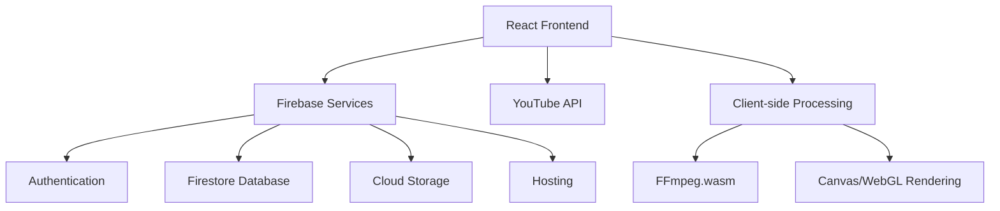
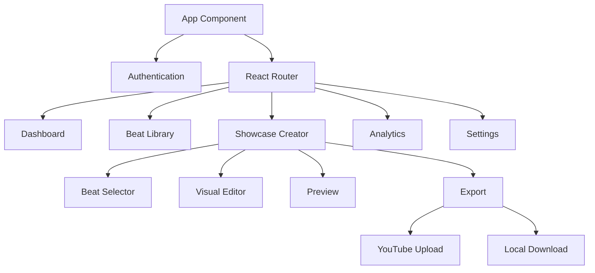

# BeatShowcase Pro - System Patterns

## Architecture Overview

BeatShowcase Pro follows a modern React-based architecture with Firebase as the backend. The system is designed for client-side processing to minimize server costs while maintaining scalability.

## Component Architecture

The application follows a component-based architecture with clear separation of concerns:

## Design Patterns

### State Management
- React Context API for global state management
- Local component state for UI-specific state
- Firebase Realtime updates for synchronized data

### Component Patterns
- Container/Presentational component pattern
- Component composition over inheritance
- Custom hooks for reusable logic

### Data Flow
- Unidirectional data flow (Redux-like pattern)
- Event-driven architecture for user interactions
- Optimistic UI updates with background synchronization

## Key Technical Decisions

### Client-side Video Processing
We've chosen to use FFmpeg.wasm for client-side video processing to:
- Eliminate server costs for video rendering
- Provide faster feedback to users
- Keep user media local for privacy/security

### Firebase Integration
Firebase provides a comprehensive backend solution:
- Authentication with multiple providers
- Firestore for structured data storage
- Cloud Storage for media files
- Hosting for application deployment
- Functions for any server-side operations

### YouTube API Usage
Direct YouTube integration allows:
- Seamless upload from the application
- Metadata optimization
- Scheduled publishing
- Performance tracking

## Error Handling Strategy
- Centralized error tracking
- Graceful degradation for non-critical features
- Detailed error messages for development
- User-friendly error messages for production
- Automatic retry for transient failures

## Performance Optimization
- Code splitting for faster initial load
- Lazy loading of non-critical components
- Progressive enhancement for feature availability
- Compression of assets
- Caching strategies for frequently used data

## Security Considerations
- Firebase security rules for data access control
- Content Security Policy implementation
- Input validation on all user inputs
- Secure handling of API keys
- Regular security audits